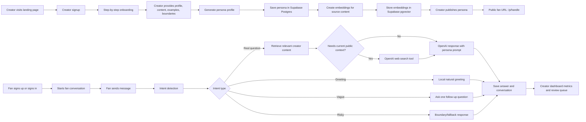

# Persona Studio AI: Architecture and Production Guide

This document is for product and engineering visibility. It explains what the product does, how the system is structured, what technology choices are being used, and what to check before pushing changes to production.

## Product Summary

Persona Studio AI lets creators or celebrities create an AI persona from approved content. The creator provides profile details, writing samples, transcripts, captions, example replies, topics, and boundaries. Once published, the creator gets a public fan chat link they can share on Instagram, Linktree, broadcast channels, or fan communities.

Fans can sign up, open the creator's public chat URL, and ask questions. The AI replies using the creator's approved public style and source material. The product clearly discloses that fans are chatting with an AI persona, not the real person.

## Main Product Surfaces

1. Landing Page

   Purpose: Explain the product and route creators into signup.

   Current route: `/`

   Key user actions:
   - Understand the creator value proposition.
   - See a simulated fan page.
   - Start creating an AI persona.

2. Creator Signup and Onboarding

   Purpose: Help a first-time creator build a persona step by step.

   Current route: `/creator`

   Onboarding collects:
   - Creator name
   - Public handle
   - Creator bio
   - Fan relationship
   - Response style
   - Greeting style
   - Source material
   - Example Q&A replies
   - Topics
   - Tone
   - Recurring phrases
   - Never-say examples
   - Guardrails
   - Fallback response

3. Creator Dashboard

   Purpose: Give returning creators a workspace after at least one persona exists.

   Dashboard should support:
   - View all personas
   - Create more personas
   - Edit existing personas
   - Pause or make personas live
   - Open/copy fan chat links
   - Track metrics
   - Review flagged or fallback conversations
   - View revenue later when monetization is enabled

4. Public Fan Chat

   Purpose: Let fans talk to a live AI persona.

   Current route pattern: `/p/[handle]`

   Example: `/p/chirag`

   Fan chat behavior:
   - Fan signs up or signs in.
   - Fan starts a conversation.
   - Chat shows a natural welcome message.
   - UI shows thinking states while the answer is generated.
   - Fan can resume conversation history.
   - Risky or off-topic prompts are handled through guardrails.

5. Runtime and Review Layer

   Purpose: Generate safe, grounded answers and give creators visibility.

Runtime responsibilities:
   - Classify fan message intent.
   - Apply moderation and guardrails.
   - Retrieve relevant creator-approved content.
   - Use web search only for real public questions when creator context is insufficient or current facts are needed.
   - Send real questions to OpenAI.
   - Save messages and metadata.
   - Mark flagged/fallback conversations for creator review.

## Architecture Diagram



## Runtime Flow

When a fan sends a message, the backend follows this flow:

1. Load the fan conversation.
2. Load the live persona connected to that conversation.
3. Check custom guardrails and never-say rules.
4. Run OpenAI moderation.
5. Classify message intent.
6. Retrieve relevant creator-approved content.
7. Decide whether web search is allowed for the turn.
8. If the message is a real question, send it to OpenAI with:
   - Creator profile
   - Creator topics
   - Creator tone
   - Creator phrases
   - Example replies
   - Never-say rules
   - Fallback response
   - Recent chat history
   - Retrieved source context
   - Web search tool access only when needed
   - Estimation mode instructions when the fan asks for calculation, damage, cost, loss, INR/NPR/USD, market size, or ranges
9. Save fan message and persona reply.
10. Update history, metrics, and review state.

## Message Intent Classification

The product currently uses four intent types:

1. Greeting

   Examples:
   - "Hey"
   - "Hi Chirag"
   - "Hey Chirag, how are you? Big fan"
   - "Love your work"

   Behavior:
   - Answer locally with a short natural reply.
   - Do not call OpenAI.
   - Do not give advice.

2. Vague

   Examples:
   - "Product"
   - "Help"
   - "Career"

   Behavior:
   - Ask one short follow-up question.
   - Do not guess what the fan meant.

3. Question

   Examples:
   - "How do I learn product management?"
   - "How did Zepto grow so fast?"
   - "Am I a Product Manager, Project Manager, or Program Manager?"

   Behavior:
   - Retrieve relevant creator content.
   - Send the message to OpenAI with the persona system prompt and chat context.
   - Allow web search only if current public context is needed and creator-approved content is insufficient.
   - Use estimation mode when the fan asks to estimate, calculate, size, or model something.

4. Risky

   Examples:
   - "Are you the real creator?"
   - "Tell me private details"
   - "What stock should I buy?"
   - "Give me medical advice"

   Behavior:
   - Use fallback or boundary response.
   - Log the interaction as flagged for review.

## Current System Prompt Strategy

The OpenAI prompt is dynamic. It is built for each persona and each fan message.

The prompt tells the model:

- You are the creator's AI persona for fan conversations.
- The page already discloses this is AI.
- Write naturally in the creator's first-person voice when appropriate.
- Sound warm, direct, familiar, and conversational.
- Answer real questions using creator profile, examples, chat context, and retrieved content.
- Do not claim to be the actual human.
- Do not invent private facts.
- Do not force catchphrases.
- Use recurring phrases only when they fit naturally.
- Format replies for a chat bubble, not an article.
- Do not use Markdown bold, headings, tables, or long uninterrupted blocks.
- If outside approved topics, use the creator's fallback response.
- If source content is insufficient, answer only what can be supported and ask one useful follow-up.
- Use web search only when enabled for a real public question, and keep the final answer grounded in the creator's persona.
- For estimation questions, provide a rough range with assumptions, simple math, and a confidence level. Do not stop at generic research advice.

The prompt includes:

- Fallback response
- Creator bio
- Fan relationship
- Response style
- Greeting style
- Ideal example replies
- Never-say examples
- Approved topics
- Tone
- Recurring phrases
- Recent chat context
- Retrieved creator context
- Optional public web context when web search is enabled
- Answer mode, such as normal chat or estimation

## Tech Choices

Frontend: Next.js, React, TypeScript

Reason:
Fast product iteration, strong routing model, shared frontend/backend codebase, good deployment support.

Backend: Next.js API routes

Reason:
Good for V0 because the backend is tightly coupled to the product UI. It avoids a separate service until scale or complexity demands one.

Database: Supabase Postgres

Reason:
Stores users, personas, conversations, messages, review data, and future revenue records in a familiar relational model.

Auth: Supabase Auth

Reason:
One auth system for creators and fans. Keeps product simple for early production testing.

Vector Search: Supabase pgvector

Reason:
Allows retrieval of relevant creator-approved content before calling OpenAI. This is important so long content does not need to be passed as one giant block.

LLM: OpenAI API

Reason:
Used for persona profile generation, fan chat answers, moderation, and embeddings.

Moderation: OpenAI moderation plus custom guardrails

Reason:
OpenAI moderation catches broad safety risks. Custom guardrails protect creator-specific reputation risks such as private life, identity confusion, and never-say rules.

Hosting: OpenAI Sites / Cloudflare-backed hosting for current prototype

Reason:
Fast deployment and testing. For a later commercial production setup, Vercel or Cloudflare Workers can also be considered.

Payments: Stripe later

Reason:
Paid chat is intentionally off for the current test. Stripe should be added when free fan chat has proven engagement.

Analytics: First-party database tables first

Reason:
The creator dashboard needs product-specific metrics: conversations, fan messages, fallback rate, flagged questions, return rate, and future revenue. PostHog can be added later for deeper funnels.

## Production Visibility for PMs

Before pushing to production, each change should answer these questions:

1. What user-facing behavior changed?
2. Which surface changed: landing, creator onboarding, dashboard, fan chat, runtime, auth, or database?
3. Does this change affect live fan conversations?
4. Does this change affect creator publishing?
5. Does this change affect auth or access?
6. Does this change affect data structure or require a Supabase SQL update?
7. Does this change affect OpenAI cost, latency, or answer quality?
8. Was build/test validation run?
9. Is the change deployed to the public site?
10. What should be tested manually after deploy?

## Recommended Release Note Format

Use this format for every production push:

```text
Release: [short title]
Date: [date]

What changed:
- [plain-English change]

Why it changed:
- [user/product reason]

User impact:
- [who benefits and how]

Risk:
- Low / Medium / High

Validation:
- Build passed
- Tests passed
- Manual check: [what was tested]

Post-deploy check:
- [specific URL or workflow to verify]
```

## Current Production Test Checklist

Creator flow:
- Creator can sign up.
- Creator can enter name and handle.
- Creator can provide persona details.
- Creator can add source content.
- Creator can add example Q&A replies.
- Creator can add never-say rules.
- Creator can publish persona.
- Creator receives a shareable `/p/[handle]` link.

Fan flow:
- Fan can sign up or sign in.
- Fan can start a conversation.
- Greeting messages feel natural.
- Real questions receive complete answers.
- Answers are formatted cleanly.
- Chat shows a thinking state while generating.
- Conversation history is visible.

Runtime quality:
- Answers use creator-approved content.
- Answers do not feel random.
- Catchphrases are not forced.
- Risky questions use fallback.
- Off-topic/private questions do not invent facts.

Dashboard:
- Creator can see personas.
- Creator can edit personas.
- Creator can pause/live personas.
- Creator can review flagged or fallback conversations.
- Metrics are visible at a high level.

## Known Next Improvements

1. Improve creator onboarding into a cleaner quiz-style experience.
2. Add better manual QA tools for testing persona answer quality.
3. Add explicit production release notes inside the repo for every deploy.
4. Add a proper admin/review view for flagged conversations.
5. Strengthen pgvector setup and ensure every production persona has stored embeddings.
6. Add observability for OpenAI failures, latency, and fallback rate.
7. Add Stripe only after free fan engagement is validated.
8. Improve mobile fan chat layout.
9. Add richer creator dashboard analytics.
10. Add better handling for source types such as uploaded docs, YouTube transcripts, and Instagram post imports.

## Current Stack Summary

```text
Product: Persona Studio AI
Frontend: Next.js + React + TypeScript
Backend: Next.js API routes
Database: Supabase Postgres
Auth: Supabase Auth
Vector DB: Supabase pgvector
AI: OpenAI API
Embeddings: OpenAI embeddings
Moderation: OpenAI moderation + custom guardrails
Payments: Stripe later
Hosting: OpenAI Sites / Cloudflare-backed runtime
Analytics: First-party tables first
```
